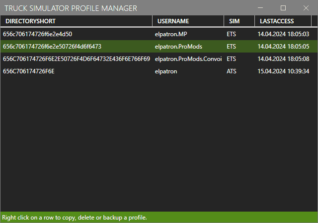
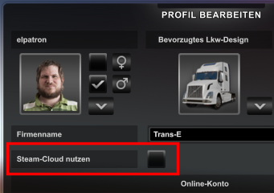
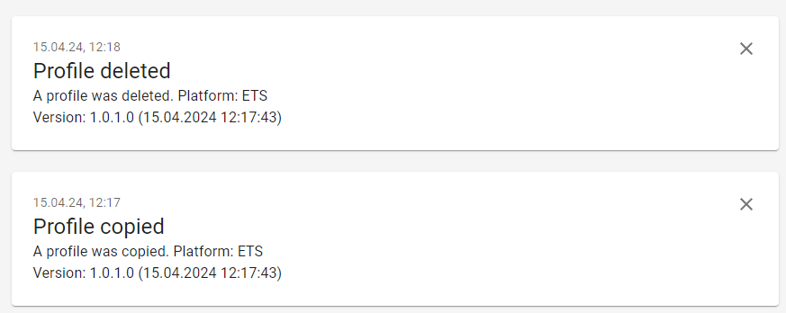

# TruckSim Profile Manager

*TruckSim Profile Manager* is a tiny tool to manage save game profiles for *Euro Truck Simulator 2* and *American Truck Simulator*.

It can 

- copy existing profiles to new ones, 
- delete existing profiles,
- backup profiles to a zip compressed file.

I made *TruckSim Profile Manager* because I didn´t find another tool, which was able to achieve this in a easy way.



## Installation

- Download the latest version from Github [releases](https://github.com/elpatron68/TruckSim-PM/releases). 
- Extract the ZIP file in a directory of your choice. 
- Start `TruckSim-PM.exe` to launch the program.

## Disable Steam Cloud Usage

You must disable Steam Cloud usage for each profile. To stop using Steam Cloud: Start the game and at the profile selection screen select your profile, then edit profile and uncheck the Steam Cloud checkbox:



## Usage

Should be self-explanatory, just right-click on a profile:

### Copy Profile

Asks for a new user name, decrypts `profle.sii`, replaces user name and copies the selected profile to a new one.

### Delete Profile

Deletes the selected profile directory.

### Backup Profile

Asks for a file name and archives the selected profile directory to a zip file. Restore by extracting the file to the profiles directory.

### Decrypt profile.sii

Decrypt the profile configuration file (for manual editing).

## Privacy Statement

As the author likes to know, if and how often this app is being used, a simple usage tracking was implemented. Absolutely no personal information (like directory- or user names or IP addresses) will be submitted.



Example usage tracking.

## License

You can do whatever you want with *TruckSim Profile Manager*.

```
DO WHAT THE FUCK YOU WANT TO PUBLIC LICENSE
                    Version 2, December 2004

 Copyright (C) 2004 Sam Hocevar <sam@hocevar.net>

 Everyone is permitted to copy and distribute verbatim or modified
 copies of this license document, and changing it is allowed as long
 as the name is changed.

            DO WHAT THE FUCK YOU WANT TO PUBLIC LICENSE
   TERMS AND CONDITIONS FOR COPYING, DISTRIBUTION AND MODIFICATION

  0. You just DO WHAT THE FUCK YOU WANT TO.
```

## 3rd Party Licenses

Please respect the licenses of these 3rd party components:

| Project Name                                                 | License                                  | Link                                                         |
| ------------------------------------------------------------ | ---------------------------------------- | ------------------------------------------------------------ |
| [SII_Decrypt](https://github.com/TheLazyTomcat/SII_Decrypt)  | Mozilla Public License Version 2.0       | https://www.mozilla.org/MPL/2.0/                             |
| [Mahapps.Metro](https://github.com/MahApps/MahApps.Metro)    | MIT License                              | https://opensource.org/license/mit                           |
| [Material Design Icons](https://github.com/MahApps/MahApps.Metro.IconPacks) | Apache License 2.0                       | https://github.com/google/material-design-icons/blob/master/LICENSE |
| [ntfy.Net](https://github.com/nwithan8/ntfy-dotnet)          | GNU General Public License v3.0 or later | https://licenses.nuget.org/GPL-3.0-or-later                  |

